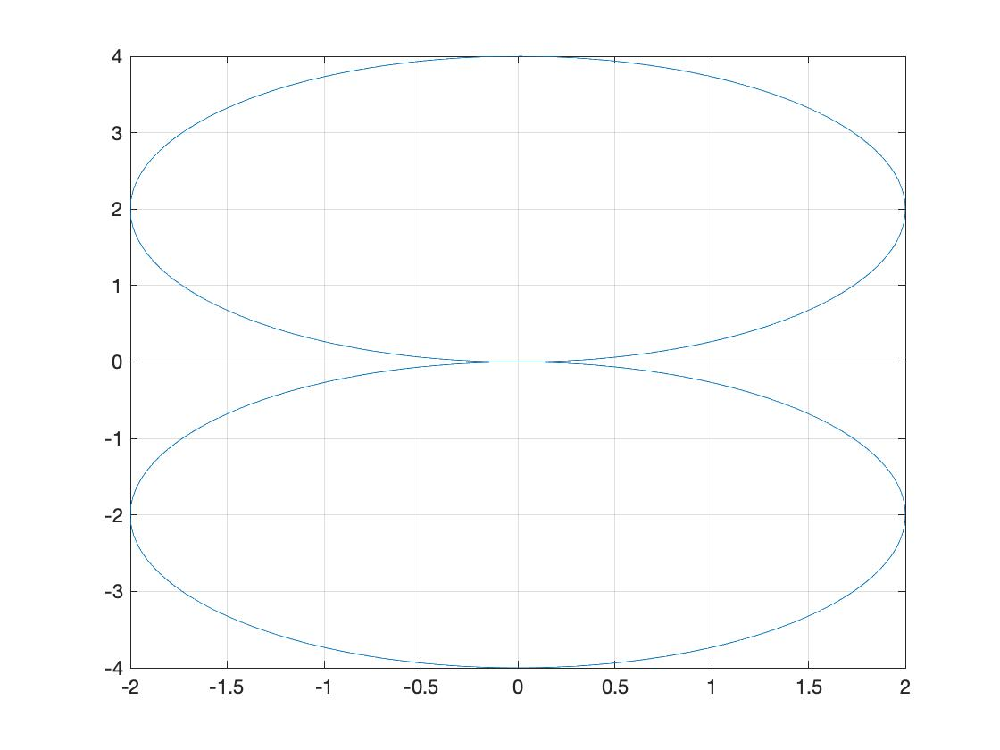
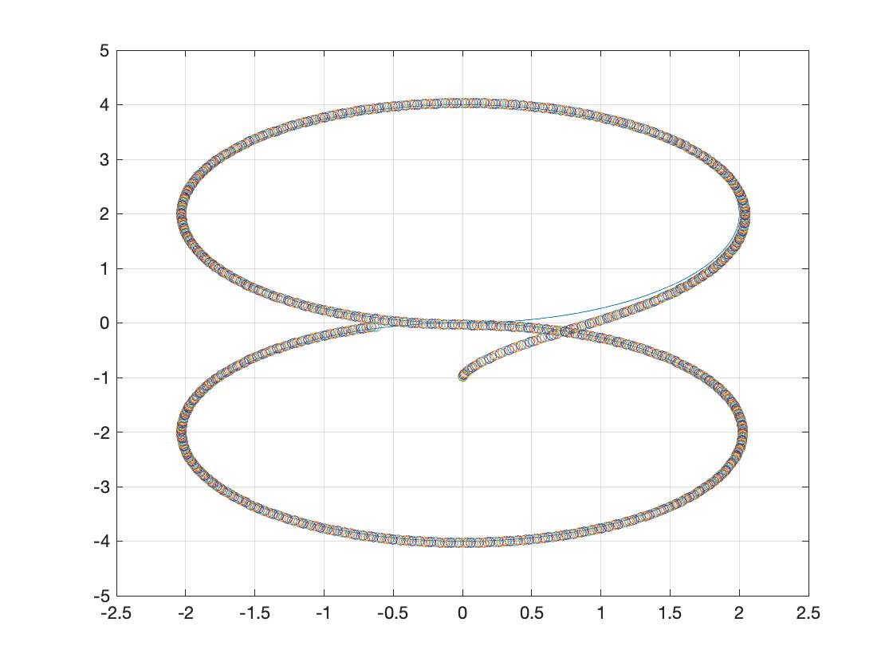

##### Model Predictive Control of WMR
refer to : http://www.ece.ufrgs.br/~fetter/mechrob04_553.pdf

#### Trajectory



#### Simulation Result



````
Iteration Number : 1236
Sampling Period dt : 0.03
Sampling Horizon : 21

Qunit : [1, 1, 0.33]
Runit : [1e-1, 1e-1]

v minimum : -4
v maximum : 4
w minimum : -4
w maximum : 4
````

